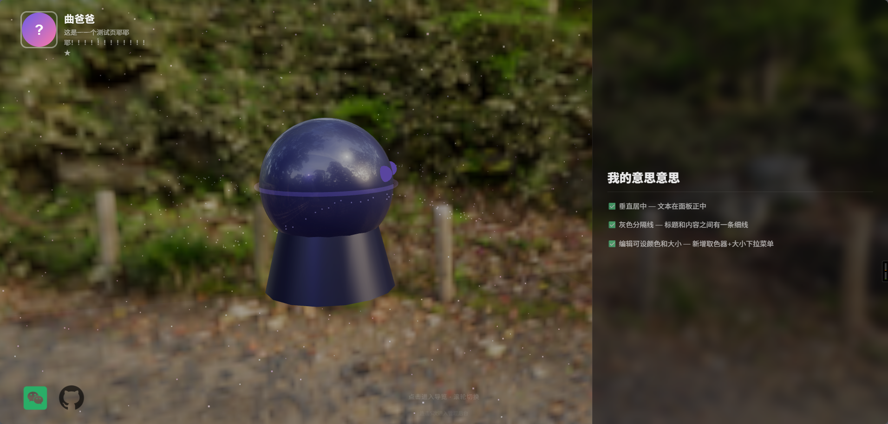

# 🎨 个人 3D 主页



基于 **Three.js + Flask** 构建的交互式 3D 个人主页。

## ✨ 功能

- **3D 场景** — Three.js 实时渲染，支持 GLB 模型加载、粒子星空、HDR 环境贴图
- **模型动画** — 上传带骨骼动画的 GLB 模型，滚轮切换镜头时同步播放不同 Pose/动画
- **镜头系统** — 从 GLB 自动提取摄像机位置，点击切换预设视角
- **导览模式** — 点击进入导览，滚轮切换镜头 + 对应动画 + 文字内容
- **内容管理** — 后台可视化编辑个人经历（富文本编辑器）、社交平台、作品展示
- **管理后台** — 密码保护，在线管理所有内容，上传模型/HDR/图片

## 🚀 快速开始

```bash
cd personal-3d-site
pip install -r requirements.txt
python app.py
```

访问 http://localhost:5001

## 📁 项目结构

```
personal-3d-site/
├── app.py                  # Flask 主程序
├── templates/              # HTML 模板
│   ├── index.html          # 3D 个人主页
│   └── admin.html          # 管理后台
├── static/                 # 静态资源
│   ├── css/style.css
│   ├── js/main.js          # Three.js 3D 场景
│   └── uploads/            # 上传文件
├── Assets/                 # 资产目录
│   ├── hdr/                # HDR 环境贴图
│   ├── hdr_preview/        # HDR 预览图
│   └── icons/              # 社交平台图标
├── models/                 # 数据库模型
├── routes/                 # API 路由
│   ├── api.py              # 公开接口
│   └── admin.py            # 管理接口
└── requirements.txt
```

## 🛠 技术栈

| 层面 | 技术 |
|------|------|
| 前端 3D | Three.js (CDN) |
| 后端 | Python Flask |
| 数据库 | SQLite |
| 编辑器 | Quill (WYSIWYG) |
| 模型格式 | GLB/GLTF |
| 环境贴图 | HDR/EXR/PNG |
